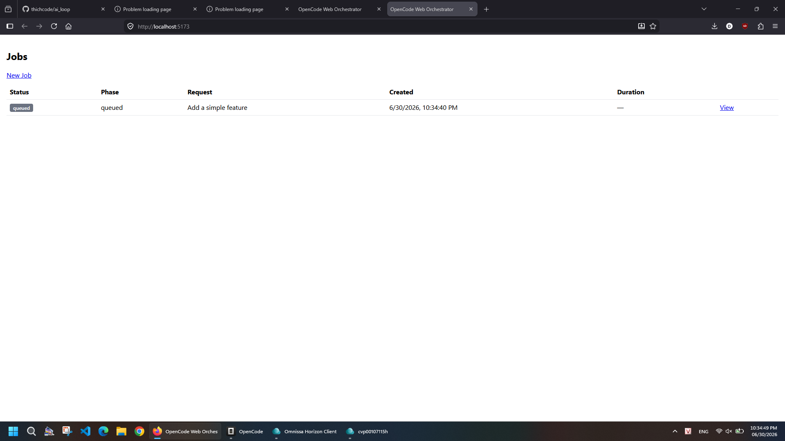
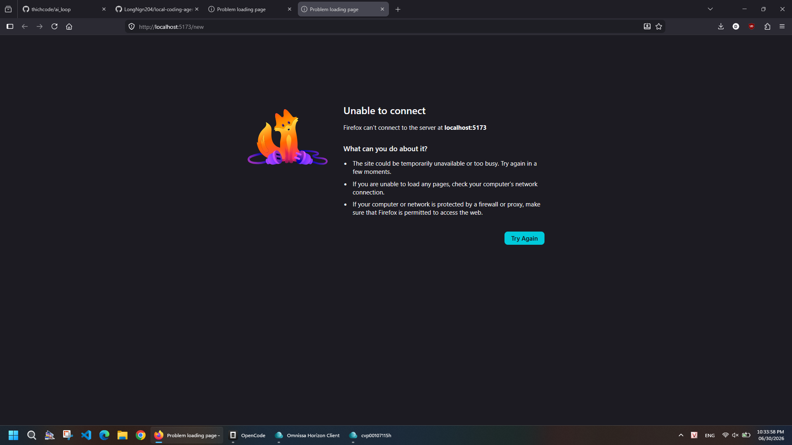
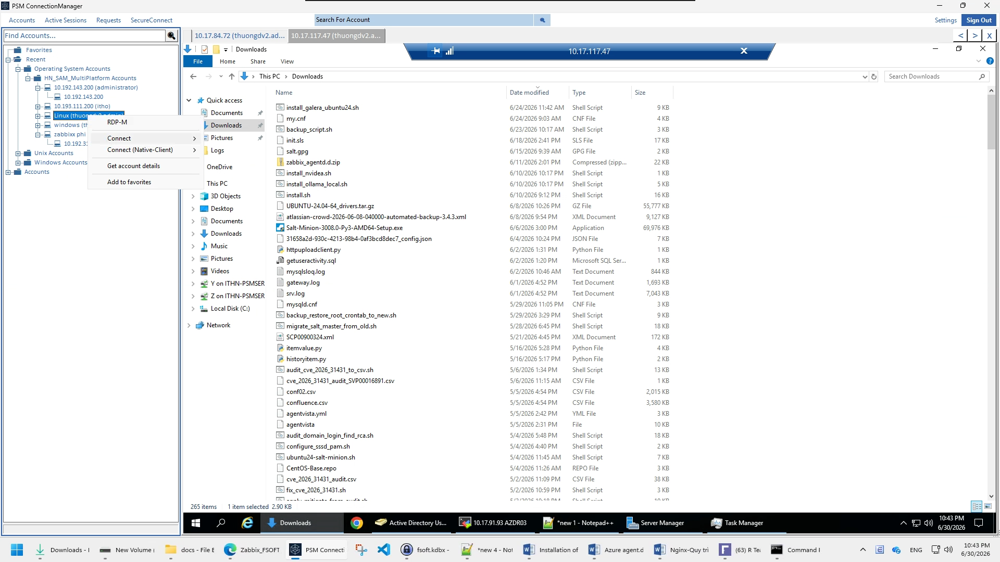

# OpenCode Web Orchestrator

Web UI để gửi coding request, hệ thống tự động plan → code → verify → review → retry → báo kết quả, tất cả đều chạy qua OpenCode CLI.

---



---

## 1. Cài đặt nhanh (2 phút)

### Yêu cầu
- Node.js 18+, npm, git
- OpenCode CLI: `npm install -g @opencode-ai/cli`
- API key cho provider bạn dùng

### Clone & install
```bash
git clone https://github.com/thichcode/ai_loop.git
cd ai_loop
npm install
npm run init-opencode
```

### Cấu hình provider

Copy file `.env.example` thành `.env` và điền API key:

```bash
cp .env.example .env
# Sửa .env với API key của bạn
```

Hoặc set trực tiếp trong terminal:

```bash
set OPENAI_API_KEY=sk-...          # nếu dùng OpenAI
set ANTHROPIC_API_KEY=sk-...       # nếu dùng Claude
```

Nếu dùng **Ollama local**, không cần API key — chỉ cần [chạy Ollama](https://ollama.com) và pull model:

```bash
ollama pull qwen3-coder:9b
```

> Xem `.env.example` để biết danh sách đầy đủ các biến môi trường.

## 2. Chạy

### Terminal 1 — API server + Web UI
```bash
npm run dev
```
Mở trình duyệt tại `http://localhost:5173`

### Terminal 2 — Worker (xử lý job)
```bash
npm run worker
```

> **Lưu ý về `WORKSPACE_ROOT`:** Mặc định không cần set — bạn có thể dùng bất kỳ thư mục nào. Nếu muốn giới hạn chỉ cho phép repo trong một thư mục nhất định, set biến môi trường `WORKSPACE_ROOT`.

---

## 3. Dùng thử

### Bước 1: Mở http://localhost:5173 → click **New Job**

### Bước 2: Điền form



| Field | Ví dụ |
|-------|-------|
| Repository Path | `C:\Users\You\repos\my-project` |
| Coding Request | `Thêm API GET /users trả về danh sách user từ database` |
| Branch Name (optional) | `feature/users-api` |
| Max Rounds | `3` |
| Planner Model | `openai/gpt-4.1` |
| Coder Model | `ollama/qwen3-coder:9b` |
| Reviewer Model | `openai/gpt-4.1` |

### Bước 3: Click **Run**



- Live log hiện real-time qua SSE
- Theo dõi task list, trạng thái từng task
- Xem diff từng task khi hoàn thành
- Khi job done → có thể Commit

---

## 4. Kiến trúc

```
Browser ──REST/SSE──► Fastify API ──SQLite──► orchestrator.db
                           ▲
                           │
Worker ──poll queue──► claimNextJob()
  │
  ├── validate repo path (nếu WORKSPACE_ROOT được set)
  ├── git status, git switch -c <branch>
  ├── opencode run --agent planner  →  TASKS.md + tasks.json
  │
  └── for each task:
       ├── opencode run --agent coder9b
       ├── npm test (verify command)
       ├── git diff
       ├── opencode run --agent reviewer
       └── retry nếu NEEDS_FIX, tối đa maxRounds
```

---

## 5. Environment Variables

| Variable | Required | Default | Mô tả |
|----------|----------|---------|-------|
| `WORKSPACE_ROOT` | Không | — | Giới hạn repo path (bỏ trống = cho phép mọi path) |
| `PORT` | Không | `3000` | Cổng API server |
| `DATABASE_PATH` | Không | `.oc-web/orchestrator.db` | File SQLite |
| `COMMAND_TIMEOUT_MS` | Không | `1800000` (30 phút) | Timeout mỗi lệnh |
| `POLL_INTERVAL_MS` | Không | `1000` | Tần suất worker poll queue |

---

## 6. npm scripts

| Script | Mô tả |
|--------|-------|
| `npm run dev` | Chạy API + Vite dev (hot reload) |
| `npm run build` | Build TypeScript + Vite + esbuild |
| `npm run start` | Chạy production server (cần build trước) |
| `npm run worker` | Chạy worker process riêng |
| `npm run init-opencode` | Tạo `.opencode/opencode.json` + agent prompts |
| `npm test` | Chạy 39-40 test |

---

## 7. Luồng job chi tiết

1. **Queued** → Worker claim → **Validating** (kiểm tra path, tạo `.oc-web/runs/<id>/`)
2. **Git** → `git status`, tạo branch nếu có
3. **Planning** → `opencode run --agent planner` tạo `TASKS.md` và `tasks.json`
4. Với mỗi task:
   - **Coding** → `opencode run --agent coder9b`
   - **Verifying** → chạy command verify từ `tasks.json`
   - **Reviewing** → `opencode run --agent reviewer`
   - Nếu `NEEDS_FIX` → chạy lại coder với feedback, tối đa `maxRounds` lần
5. **Finalizing** → tổng hợp diff, changed files, final summary
6. Kết quả: **done** / **partial** / **failed** / **cancelled**

---

## 8. An toàn

- ✅ Chỉ cho phép repo path dưới `WORKSPACE_ROOT` (nếu được set)
- ✅ Không auto-push, không auto-commit (phải bấm Commit)
- ✅ Git status dirty vẫn chạy được, không mất code
- ✅ Diff hiển thị trước khi commit
- ✅ Cancel job được hỗ trợ (kills process đang chạy)
- ✅ Timeout cấu hình được cho mọi lệnh
- ✅ Logs lưu cả DB và file `.oc-web/runs/<id>/log.txt`

---

## 9. Troubleshooting

| Vấn đề | Giải pháp |
|--------|-----------|
| `Repository path does not exist` | Đường dẫn bạn nhập không tồn tại, kiểm tra lại |
| `Repository path must be under WORKSPACE_ROOT` | Path nằm ngoài `WORKSPACE_ROOT` — bỏ `WORKSPACE_ROOT` hoặc chọn path khác |
| `opencode: command not found` | Cài OpenCode CLI: `npm install -g @opencode-ai/cli` |
| Worker không chạy | Kiểm tra `WORKSPACE_ROOT` đã set, thư mục parent của DB tồn tại |
| Verify command fail | Sửa command verify trong `tasks.json` do planner tạo |
| Job treo, không có log | Kiểm tra OpenCode provider config, model có hoạt động không |
